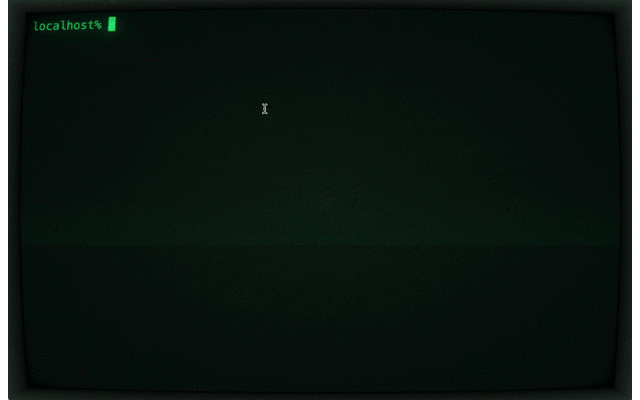

# zsh-romaji-complete

zshのタブ補完でローマ字による日本語ファイル名補完ができるようにします。

例: `niho<Tab>` で`日本`で始まるファイル名が補完されます。



## セットアップ

### 1. kakasiをインストール

```console
$ git clone --depth 1 git@github.com:loretoparisi/kakasi.git
$ cd kakasi
$ ./configure && make && make install
```

### 2. zsh-romaji-completeをインストール

#### a) With a plugin manager

```
bindkey "^I" menu-expand-or-complete
zplug "aoyama-val/zsh-romaji-complete"
```

などと。

#### b) Manually install

お好きな場所にクローンします:

```console
$ git clone git@github.com:aoyama-val/zsh-romaji-complete.git
```

`~/.zshrc`に下記を追加:

```
bindkey "^I" menu-expand-or-complete
fpath+=({クローンしたディレクトリ} $fpath)
. {クローンしたディレクトリ}/zsh-romaji-complete.plugin.zsh
```

zshのデフォルトでは `^I` は `expand-or-complete`ですが、それだと候補が複数ある場合に何も補完されません。
